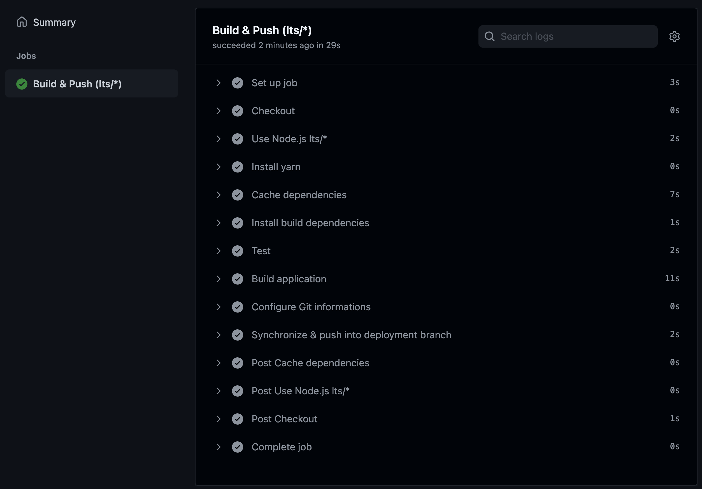

Deploy application to GIT branch 
===
This project follows the DEV.to [#ActionsHackathon21](https://dev.to/devteam/join-us-for-the-2021-github-actions-hackathon-on-dev-4hn4) hackathon.

Use GitHub Actions and Workflows to build and deploy your applications to a branch. So you can just pull this branch to deploy on the production server, without building.

Check the complete workflow here ([build-and-deploy-to-branch.yml](.github/workflows/build-and-deploy-to-branch.yml))

## Actions used
- **[actions/checkout@v2](https://github.com/actions/checkout)** To checkout the source code from the repository
- **[actions/cache@v2](https://github.com/actions/cache)** To cache the dependencies, allow us to re use them for future builds

(Also **[actions/setup-node@v2](https://github.com/actions/setup-node)** for setup nodejs, although it's not required)

## Configurations
- You can config the deployment branch postfix, with `DEPLOY_BRANCH_POSTFIX` variable. So the code on "main" branch will be built and pushed into `main-<DEPLOY_BRANCH_POSTFIX>` branch
- You can also configure the branches which you want to run this workflow, with `branches` key.

## Flows
In this repository, I use a sample [NextJS](https://nextjs.org/) to demonstrate. However you can change the workflow a bit to fit your project.

- Use **[actions/checkout@v2](https://github.com/actions/checkout)** to checkout source code from the repository
- Use **[actions/setup-node@v2](https://github.com/actions/setup-node)** to setup nodejs
- Use **[actions/cache@v2](https://github.com/actions/cache)** to cache dependencies (`node_modules` and `.yarn` directories)
- Install dependencies with `yarn`
- Run tests
- Build application
- Synchronize built files with deployment branch
- Push build into the deployment branch
